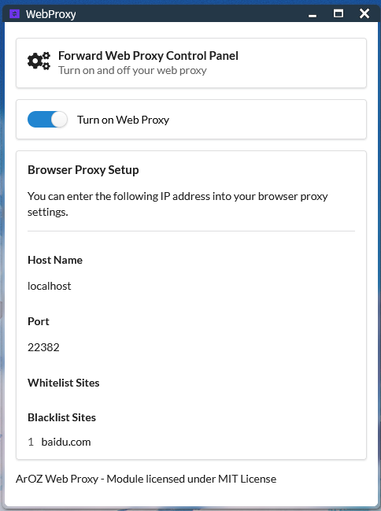

# webproxy

A basic web proxy subservice for ArozOS

**THIS IS NOT A WEBAPP. DO NOT INSTALL VIA MODULE INSTALLER**

## Installation

### Requirement

- Go 1.14 or above

### Build Instruction

git clone this repo in the subservice folder and run build.sh. The  following examples assume your arozos root folder is located at `~/arozos`

```
cd `~/arozos/subservice/
git clone https://github.com/aroz-online/webproxy
cd webproxy
./build.sh
```

## Configuration

Modify config.json.example to fits your needs. The content of the config.json should look like this

```
{
  "proxyport": 8081,
  "defaulton":true,
  "whitelist":[],
  "blacklist":[]
}
```

You can setup a custom port for your webproxy and modify the whitelist or blacklist website. Here is an example of changing web proxy port to 22382 and blacklist "baidu.com"

```
{
  "proxyport": 22382,
  "defaulton":true,
  "whitelist":[],
  "blacklist":["baidu.com"]
}
```

After that, you can setup your browser accordingly. Here is an example from Firefox settings.


Go to Options --> Network Settings


Fill in the information of your host accordingly.


If you are unable to connect to the internet after you have set up your web proxy, check the followings.

- Router port forwarding settings
- Firewall (if any, specially if you are using it on Window Host)
- Check if that port is blocked by your ISP

### Screenshot



## License

MIT License